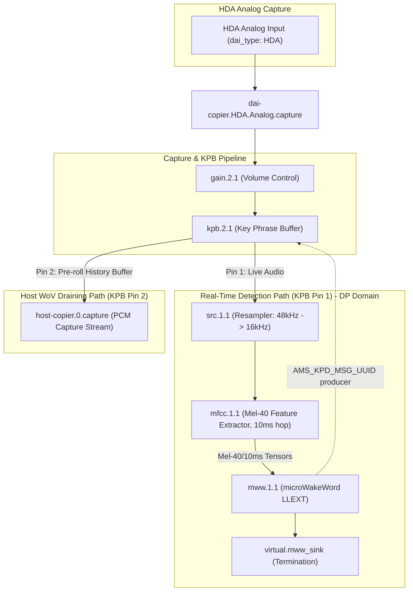

# microWakeWord (MWW) Architecture

This directory provides an SOF component wrapping [OHF-Voice's
microWakeWord](https://github.com/OHF-Voice/micro-wake-word) streaming
keyword-spotting model, integrated with MFCC feature extraction and the
same Key Phrase Buffer (KPB) Wake-on-Voice (WoV) trigger infrastructure
used by `src/audio/tensorflow` (`tflmcly`). Unlike `tflmcly`'s 4-way
softmax classifier, microWakeWord outputs a single sigmoid wake-word
probability from a stateful streaming TFLM graph.

---

## Overview

`mww` consumes 40-bin mel feature hops from the upstream `mfcc` component,
requantizes them per the model's real `input_scale`/`input_zero_point`,
and runs inference via TensorFlow Lite Micro in the **Data Processing
(DP) domain**. The reference model (`hey_jarvis.tflite` v2) is a MixConv
streaming graph that keeps its own internal ring-buffer state (TFLM
resource variables + a `CALL_ONCE` init subgraph), so `mww` only needs to
supply `MWW_FEATURE_SLICE_COUNT` (3) fresh 10ms/40-bin hops per
`Invoke()` rather than maintaining a caller-side sliding window.

When `probability >= MWW_DETECT_THRESHOLD` (0.5), `mww` acts as an **AMS
producer** of `AMS_KPD_MSG_UUID` — mirroring
`src/samples/audio/detect_test.c`'s pattern
(`ams_helper_register_producer()` / `ams_helper_prepare_payload()` /
`ams_send()`) rather than `tflmcly`'s notifier call — to signal KPB to
drain its pre-roll audio history to the host. `src/audio/kpb.c`'s
existing AMS-consumer branch requires no changes to receive this.

---

## Architecture & Data Flow

Structurally identical to `tflmcly`'s dual-path WoV topology (see
`src/audio/tensorflow/README.md`), with `mww` in place of `tflmcly` and
its own 10ms-hop MFCC profile:



---

## Deployment Targets

- **Aphid (PTL / ACE 3.0)**: `CONFIG_COMP_MWW=m`, built and deployed as a
  real loadable `.llext` module — the target that exercises SOF's LLEXT
  loading/relocation path, not just a compile check.
  `app/boards/intel_adsp_ace30_ptl.conf` disables `CONFIG_COMP_TENSORFLOW`
  on this board (tflmcly is not yet GNU-toolchain-clean here, and mww
  builds its own independent TFLM lib copy so it doesn't need it).

Building `mww` as a real LLEXT module (rather than statically linked)
required several fixes to SOF's and Zephyr's LLEXT support, landed
alongside this component:

- `library_manager/llext_manager.c` — section rebase/relocation fixup
  after SOF's own address rebasing, `.bss`/`DATA` region packing, and a
  tracked `.exported_sym` segment.
- `zephyr/CMakeLists.txt` — `-Wl,-Bsymbolic-functions` so multi-TU C++
  internal calls (TFLM spans many `.cc` files) resolve locally.
- `src/lib/cpp_new_export.cpp` — exported `operator new`/`delete`/
  `__cxa_pure_virtual` for C++ LLEXT modules.
- A companion Zephyr fork branch (`feature/llext-stb-weak-fixes`) treats
  `STB_WEAK` symbols (C++ template-instantiated vtables/typeinfo) the
  same as `STB_GLOBAL` in the LLEXT export table, PLT resolution, and
  `GLOB_DAT`/`JMP_SLOT` relocation — required for TFLM's vtables to
  resolve correctly inside the loaded module.

---

## Building and Testing

### Building the topology target

From `sof/tools/build_tools`:

```bash
ninja topology2_prod_sof-ptl-hda-mww-kpb
```

### Deploying and testing on aphid

```bash
# Pristine firmware + llext build
CCACHE_DISABLE=1 ./sof/scripts/xtensa-build-zephyr.py -p ptl -k sof/keys/otc_private_key_3k.pem

# Deploy .ri / sof-ipc4-lib tree / .tplg to aphid, then reboot to load
ssh -i ~/.ssh/aphid_deploy root@aphid 'timeout 10s arecord -D hw:0,0 -f S32_LE -r 16000 -c 2 -d 10 /tmp/test.wav'
ssh -i ~/.ssh/aphid_deploy root@aphid 'timeout 10s /usr/local/bin/mtrace-reader.py'
```

Look for `MWW DBG feature range` and `MWW probability=` log lines in the
mtrace output.

---

## Known Issues / Open Items

### 1. MFCC hop cadence did not halve when switching to the 10ms profile

Switching the MFCC profile's `frame_shift` from 20ms (the interim
`mel40_compress.conf` used for Stage 2 hardware validation) to 10ms
(`mel40_10ms.conf`, this component's native frontend shape) was expected
to double the real wall-clock rate at which `mww_process()` fires
(~100/s vs ~50/s), motivating a DP task budget check
(`CONFIG_STACK_SIZE_EDF`/`CONFIG_HEAP_MEM_POOL_SIZE`).

Measured on aphid hardware: the cadence between consecutive
`mww_process` `probability=` log timestamps stayed at ~76ms, statistically
unchanged from the 20ms-hop profile's cadence. This was confirmed to be
a real measurement, not an mtrace ring-buffer duplicate-read artifact
(the compared timestamps are genuinely distinct, not byte-identical
repeats).

**Hypothesis (unconfirmed):** the pipeline's DP scheduling period, or how
much audio the upstream `src` component delivers per period, governs the
real rate at which `mfcc`'s `copy()` is invoked — not the `frame_shift`/
`frame_length` values baked into the MFCC config blob. Those values only
control how the MFCC math windows/hops *within* whatever audio chunk it
receives per period; they don't themselves change how often `copy()` is
scheduled. If a genuinely faster feature rate is needed for lower wake
detection latency, the pipeline's period/scheduling parameters — not just
the MFCC blob — likely need to change as well. This has not yet been
investigated.

### 2. `arecord` debug-drain I/O error

`arecord` against the debug-drain PCM device (`hw:0,1`) intermittently
returns `read error: Input/output error`. This has been confirmed
isolated to the debug-drain path — it does not affect the core `mww`
detection pipeline's correctness (feature ranges, inference, and KPB/AMS
signaling have all been independently verified working on hardware).
Root cause not yet identified.

---

## Source Files

- **mww.c**: SOF module adapter implementation (init/prepare/process/reset,
  AMS producer signaling).
- **mww_model.cc** / **mww_model.h**: TFLM C++ API bridge exposing
  `MWW_SetModel()` / `MWW_InitOps()` / `MWW_ProcessClassify()`.
- **mww_model_data.cc** / **mww_model_data.h**: model flatbuffer data
  (placeholder, swappable for a trained/converted checkpoint).
- **mww.toml**: rimage module manifest entry.
- **llext/**: LLEXT build scaffolding (CMakeLists.txt, llext.toml.h,
  reentrant-stub shims mirroring `src/audio/template/`).
- **../../tools/topology/topology2/include/components/mww.conf**:
  Topology v2 widget class definition.
- **../../tools/topology/topology2/include/pipelines/cavs/host-gateway-src-mfcc-mww-capture.conf**:
  Detection pipeline template.
- **../../tools/topology/topology2/sof-hda-mww.conf**: Top-level WoV
  topology configuration.
